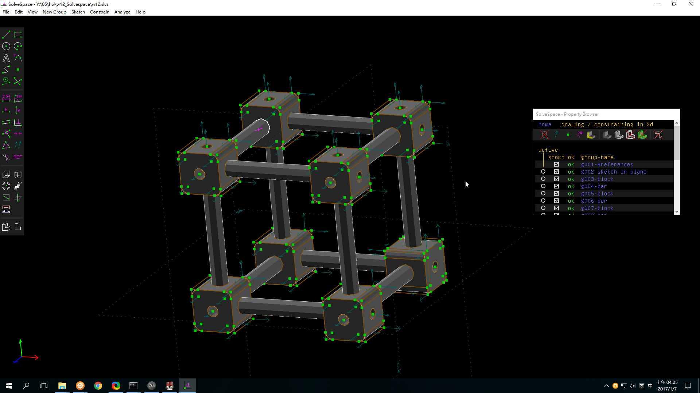

Title: w12_Solvespace
Date: 2016-12-09 12:00
Category: 作業
Tags: 作業, Solvespace
Author: 40223205

##Solvespace

###1.繪製零件

範例： <a href="./../w12_Solvespace/College_Student_Primer_Creo_2.pdf">College_Student_Primer_Creo_2.pdf</a>

(a.)block

<iframe src="./../w12_Solvespace/W14-1.html" width="500"  height="500"/></iframe>

<iframe src="https://player.vimeo.com/video/194924122" width="640" height="492" frameborder="0" webkitallowfullscreen mozallowfullscreen allowfullscreen></iframe>

(b.)bar

<iframe src="./../w12_Solvespace/W14-2.html" width="500"  height="500"/></iframe>

<iframe src="https://player.vimeo.com/video/194933777" width="640" height="492" frameborder="0" webkitallowfullscreen mozallowfullscreen allowfullscreen></iframe>

(c)組立

###心得

練習Solvespace教材的組立,觀看老師的教學可以輕鬆做出來,可零件在網頁上一直顯示錯誤,零件的地址已經改相對卻一直失敗,練習很多次.
畫畫不難,作業也不難,難的是你按部就班還是會錯誤,幫QQ
