Title: w16
Date: 2017-01-06 12:00
Category: shareX
Tags: 作業, Solvespace,Onshape
Author: 40223205

教材:
<a href="http://chiamingyen.github.io/kmolab_data/files/ProEMechanism.pdf">http://chiamingyen.github.io/kmolab_data/files/ProEMechanism.pdf</a> 

利用Onshape 教材繪畫裡面的組零件,在開啟老師的Solvespace檔案觀看相對運動

#Solvespace

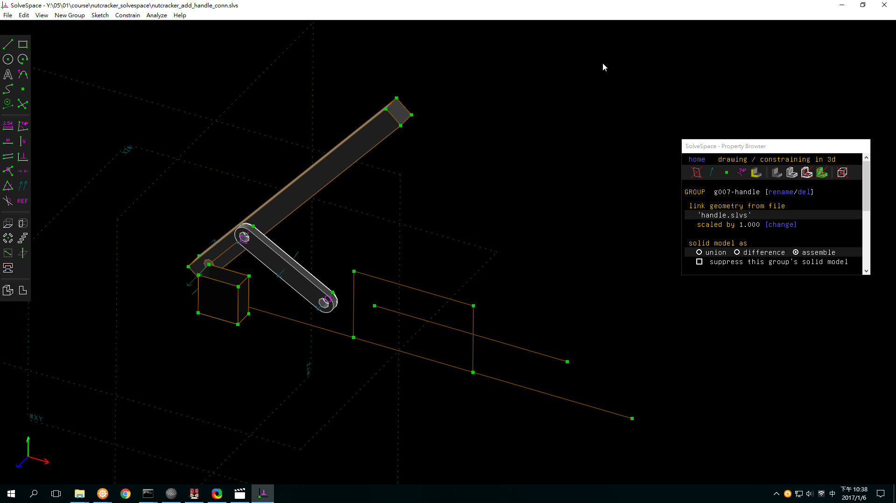

#Onshape

###圖
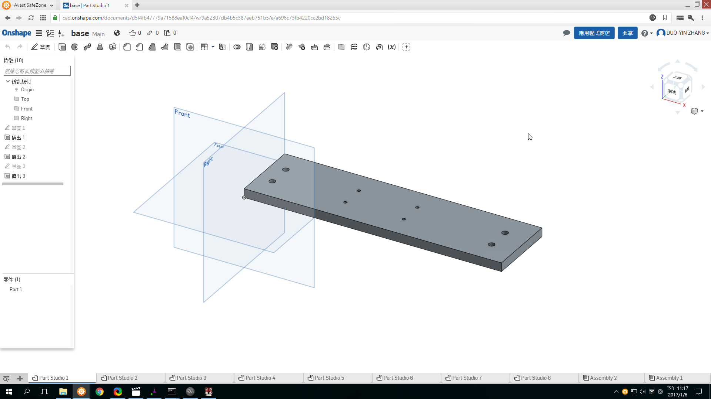
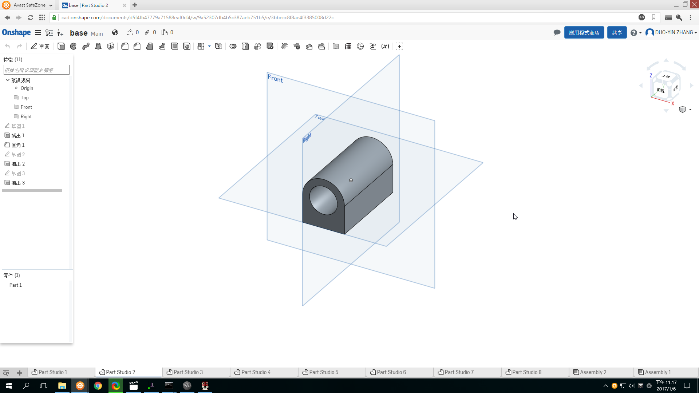
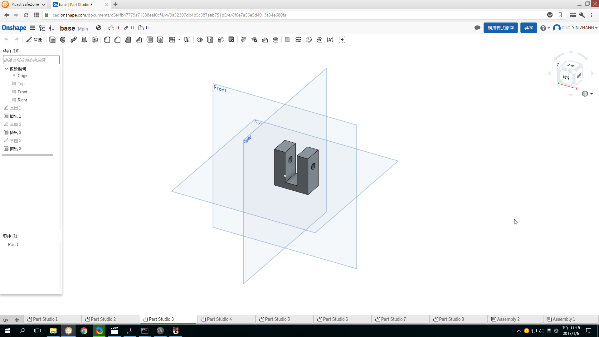
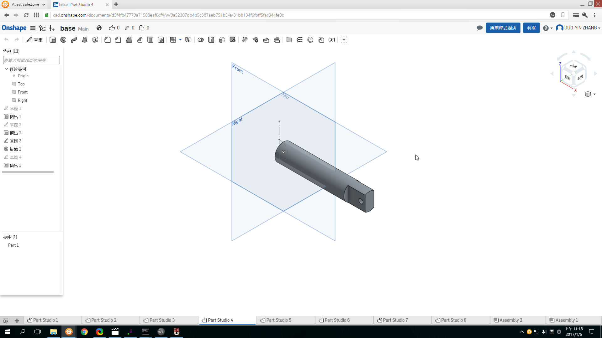
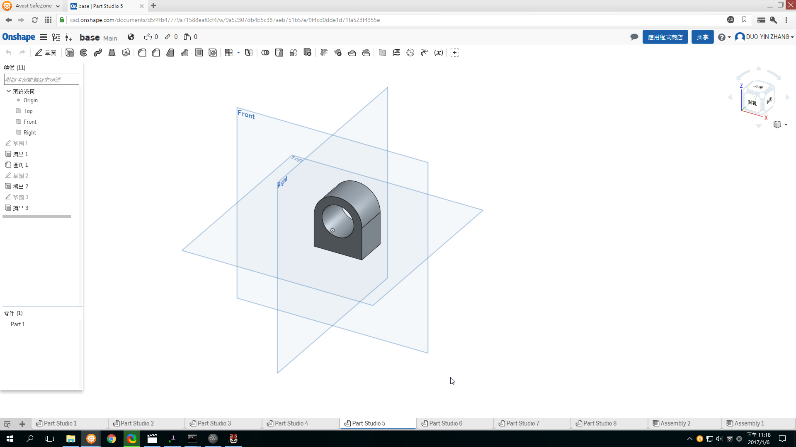
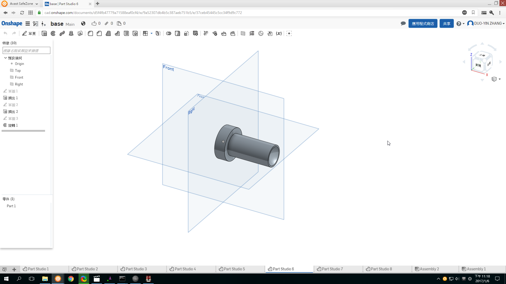
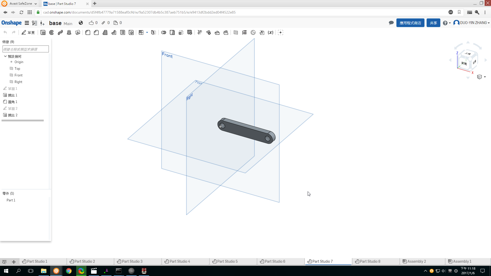
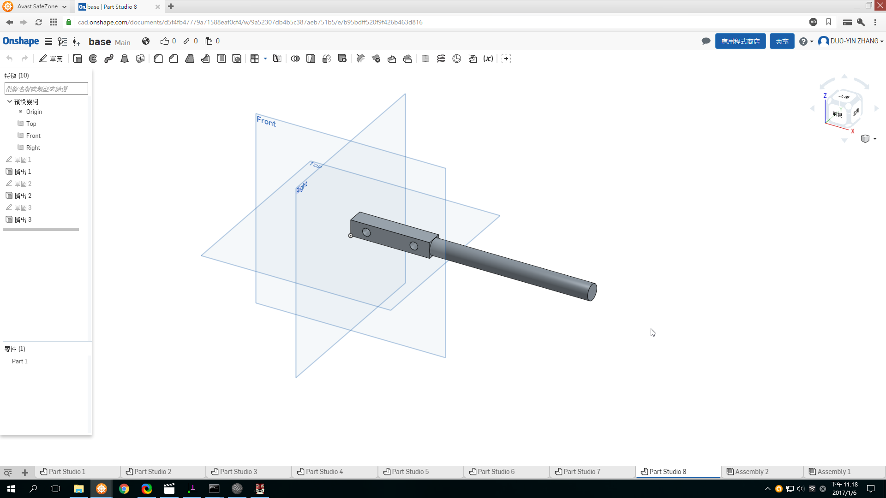
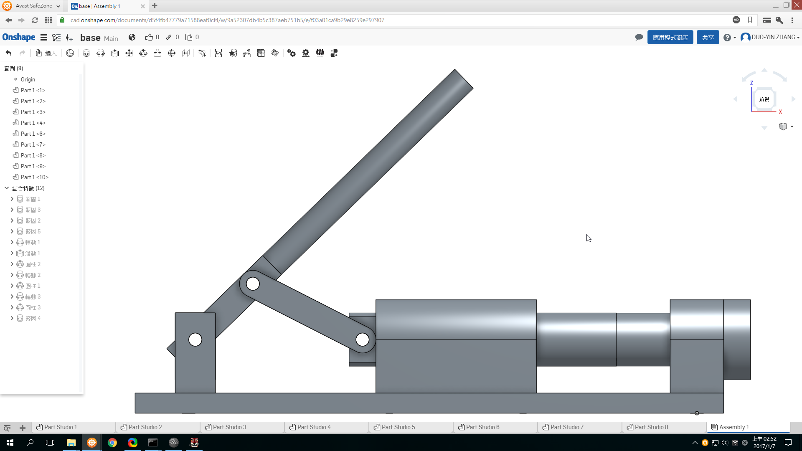
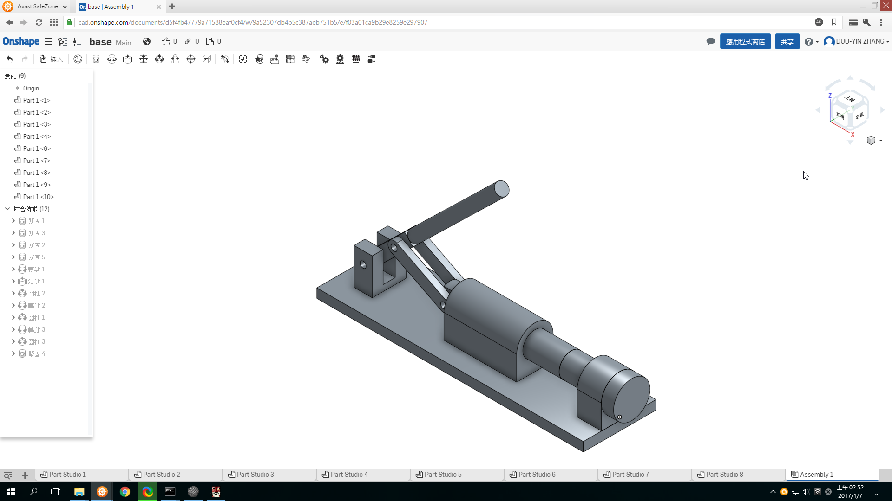

###影片

a.零件、組立

<iframe src="https://player.vimeo.com/video/198384503" width="640" height="492" frameborder="0" webkitallowfullscreen mozallowfullscreen allowfullscreen></iframe>

###b.問題:如何精確的得知此機構的運動約束位置

<iframe src="https://player.vimeo.com/video/198386173" width="640" height="492" frameborder="0" webkitallowfullscreen mozallowfullscreen allowfullscreen></iframe>

組裝後假設機構的最小位置(如下圖)為1.5in 再來設定圓桿的最小與最大衝程即可得出答案

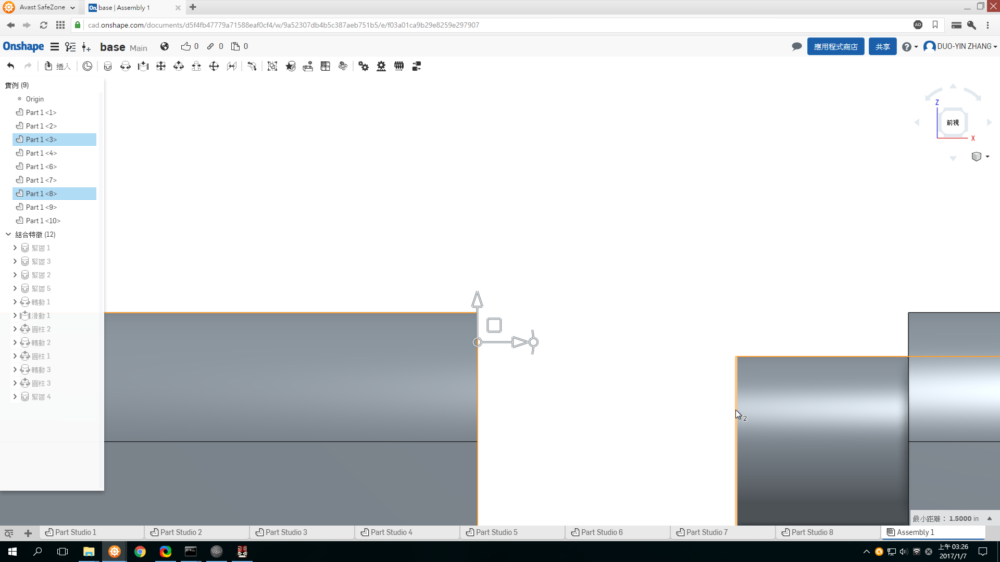
###心得

此機構有滑動運動還有轉動運動,Onshape組立可以直接點選作動進行約束,在曲柄與圓桿部分進行同心圓約束就可以進行運動.
在線上組合這點我給Onshape很高的評價,他可以直接進行點與面的約束,反觀軟體也可做卻無法直觀的點選,需要做很多步驟.
